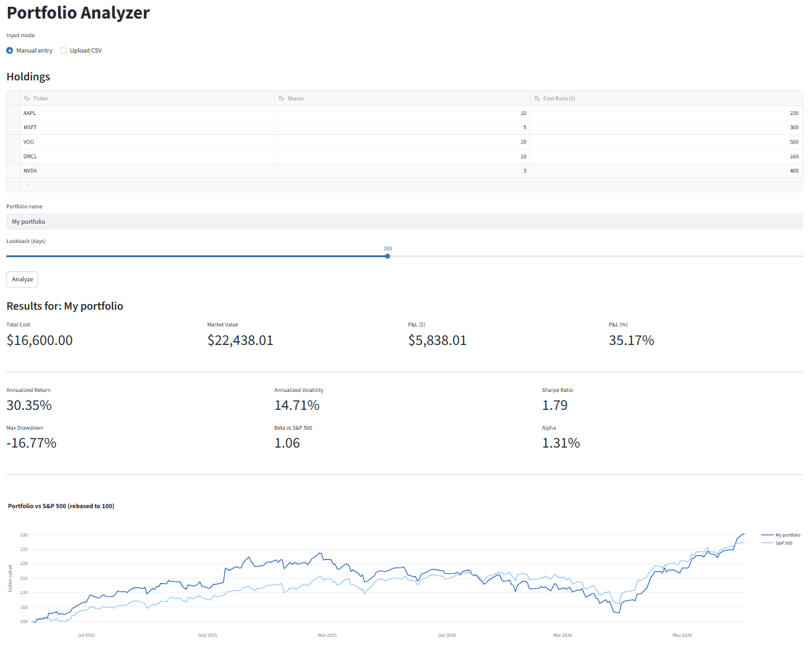

# Portfolio Analyzer

  A Python-based portfolio analysis tool for U.S. stocks.

  **Live demo:** [https://nirissa-portfolio.streamlit.app](https://nirissa-portfolio.streamlit.app)

  

  ## Features

  - **Multi-ticker portfolio input**: manual entry or CSV upload
  - **8 standard financial metrics**: cumulative & annualized return, annualized volatility, Sharpe ratio, max drawdown, Beta,
  Alpha, correlation matrix
  - **5 visualization sections**: P&L overview, metric cards, NAV vs S&P 500 chart, correlation heatmap, holdings allocation
  pie
  - **S&P 500 benchmark comparison** for relative performance
  - **Local SQLite cache** to reduce external API calls during development
  - **Graceful error handling**: invalid tickers, network failures, malformed CSV all surface as warnings, never crashes

  ## Tech Stack

  Python 3.14 · Streamlit · Pandas · NumPy · yfinance · Plotly · SQLite · pytest

  ## Architecture

  Strict 3-layer separation:

  src/
  ├── data/         # yfinance fetching + SQLite caching
  ├── analytics/    # Pure-function metric calculations (100% unit-tested)
  └── ui/           # Streamlit components and Plotly chart builders

  The `analytics/` layer accepts Pandas Series and returns numbers — no I/O, no network calls. This makes every metric
  trivially unit-testable with synthetic data.

  ## Run Locally

  ```bash
  # 1. Clone
  git clone https://github.com/NirissaCamp/portfolio-analyzer.git
  cd portfolio-analyzer

  # 2. Create and activate virtual environment
  python -m venv venv
  .\venv\Scripts\Activate.ps1   # Windows PowerShell
  # source venv/bin/activate    # macOS / Linux

  # 3. Install dependencies
  pip install -r requirements.txt

  # 4. Run the app
  streamlit run app.py

  Then open http://localhost:8501 in your browser.

  Test

  pytest tests/ -v

  Tests cover all analytics functions (returns, risk, ratios, correlation) plus the SQLite cache layer.

  CSV Format

  When using the "Upload CSV" mode, files must have these columns:

  ticker,shares,cost_basis
  AAPL,10,150.00
  MSFT,5,300.00
  NVDA,3,400.00

  Rows with missing tickers or zero shares are skipped (with a warning).

  Screenshots

  assets/screenshots/charts.png

  Project Structure

  portfolio-analyzer/
  ├── app.py                  # Streamlit entry point
  ├── requirements.txt
  ├── .streamlit/
  │   └── config.toml         # Theme and runtime settings
  ├── src/
  │   ├── config.py           # Constants (risk-free rate, benchmark ticker, etc.)
  │   ├── data/               # Data fetching + caching
  │   ├── analytics/          # Financial metric calculations
  │   └── ui/                 # Streamlit UI components
  ├── tests/                  # pytest unit tests
  └── assets/screenshots/     # README images

  Roadmap

  - [x] Phase 1: Portfolio dashboard MVP (this release)
  - [ ] Phase 2: ML-based return prediction
  - [ ] Phase 3: AI Q&A with RAG over financial news

  License

  MIT
